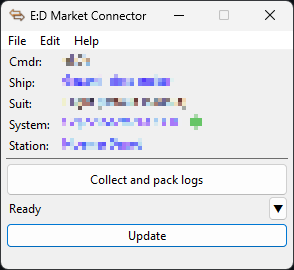
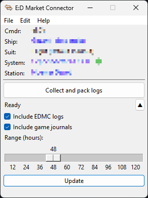

*This README is also available in [Russian](./README.ru.md).*

# EDMC-LogCollector

A plugin for quickly collecting fresh EDMC logs and game journals, intended primarily for debugging purposes.

### Features

- Configuration of which specific files you want to collect and for what time period
- Full Windows and Linux support
- Dark/transparent theme support
- Update checks
- English and Russian localizations

### Appearance

|  | 
| --- | ---

### Compatibility

**The plugin is compatible with EDMC versions 5.0 and higher.**

The code aims to be suitable for Python 3.7 and higher, which offers the potential to improve compatibility down to EDMC 4.0. However, this would require removing the `semantic-version` dependency (EDMC provides this module starting from version 5.0), which is technically possible but doesn't seem necessary to me at this stage.

---

This plugin is licensed under the GPLv3. See the [LICENSE](./LICENSE) file for the details.
