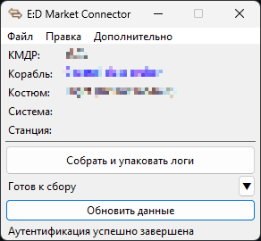
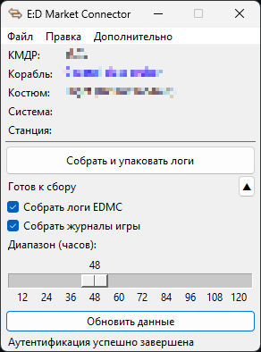

*Этот README также доступен на [английском](./README.md).*

# EDMC-LogCollector

Плагин для быстрого сбора последних логов EDMC и игровых журналов, предназначенный в первую очередь для отладки.

### Возможности

- Настройка, какие конкретно файлы и за какой промежуток вы хотите собрать;
- Поддержка работы на Windows и Linux;
- Поддержка тёмной и прозрачной тем;
- Проверки обновлений;
- Русская и английская локализации.

### Внешний вид

|  | 
| --- | ---

### Совместимость

**Плагин совместим с версиями EDMC 5.0 и выше.**

Код нацелен на совместимость с Python 3.7 и выше, что даёт потенциал для улучшения совместимости вплоть до EDMC 4.0, однако это потребует избавления от зависимости `semantic-version` (EDMC предоставляет этот модуль начиная с версии 5.0), что технически возможно, но на данный момент не видится мне строго необходимым.

---

Этот плагин распространяется под лицензией GPLv3. Подробности см. в файле [LICENSE](./LICENSE).
